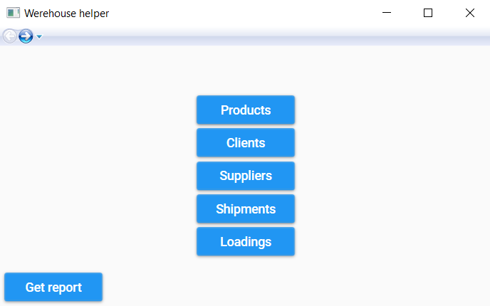
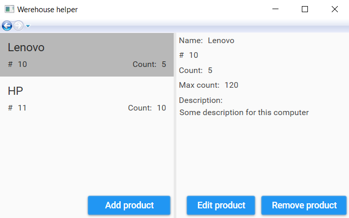

# WarehouseHelper

WarehouseHelper is a simple accounting program with following entities:
1) Client is who does an order for some product
2) Supplier is who provide the product
3) Shipment stores basic information about client, product, count of products and date
4) Loading stores information about supplier, product, count of products and date

Main page looks like this:

Other pages are a bit similar in functionality:

